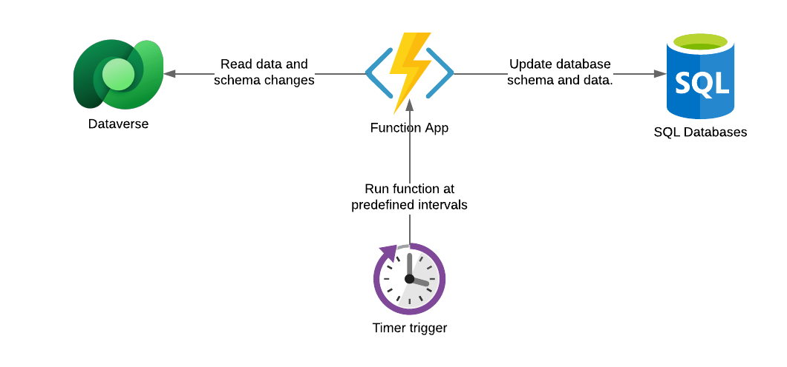

# Dataverse Data Export Service
This solution aims to provide similar data export capabilities to the ones  found in the [Microsoft Data Export Service (DES)][1] and therefore replaces the service which reached end-of-life in November 2022.

While the source code includes an implementation of the service as an Azure function and this document will be focused on that, one could potentially use the same concept to run it as a command line application, docker container, windows service and so on. The Azure function is just a wrapper to the service which is contained on a .net 6 class library project.

## Basic Concepts

The service relies on the built in table (entity) change tracking capability to synchronize data. Change tracking allows the service to reliably retrieve only the changes between the last an current call to the dataverse api.

The service will automatically enable change tracking for the table (entity) being synchronized if it is not already done.

## Azure Function and Consumption Plans

The Azure function implementation uses a timer trigger and the inteval can be set in the app configuration ( details below).

Things to keep in mind if running Azure functions on a consumption plan:

- The function will time out after 10 minutes. You want to keep your timer interval short enough to prevent a synchronization of large volumes of data that might go over 10 minutes.
- The first time you run the function it may take a while to complete depending on the number of tables being synchronized and volume of data on each table. You may need a "non-consumption" plan to run the initial synchronization, after that you can stop the function and move to a consunption plan.

## Configuring the Azure Function

Once the function app is deployed, make sure at least the required configuration keys (see below table) are applied.

For more  information on how to add settings to a function app, visit: [Manage your function app][4]

### Function App Settings

| Key  | Description  |
| ---- | ------------ |
| ClientId | (Required) The application ID used to connect to the dataverse. |
| ClientSecret | (Required) The application secret used to connect to the dataverse. |
| DataverseInstanceUrl | (Required) The dataverse instance URL.
| DataverseQueryPageSize | (Optional) The page size used when querying the dataverse API. Only change this value if the records in some of your tables are too large and you are experiencing SQL errors. Default is 5000. |
| ScheduleCronExpression | (Optional). A cron expression indicating the timer interval or how often the function will run. More info on cron expressions can be found [in the timer trigger documentation][2]. The default value is 15 minutes. |
| SqlCommandTimeoutSeconds | (Optional) The time out applyed to SQL Commands. Default is 30 seconds. |
| RetryLinearBackoffInitialDelaySeconds | (Optional) The initial delay applied to the exponential back-off back off retry policy. Default is 30 seconds. |
| RetryLinearBackoffRetryCount | (Optional) Number of attempts made by the retry policy. Default is 6.
| StoreConnectionString | (Required) The SQL database connection string (use the connection string section of the app settings or in the Azure portal). |

An wait and retry policy with exponential back off is used when connecting to external services such as the dataverse API. for more information on retry policies visit the [Polly wait and retry documentation][3].

## Questions and Answers

**Q: How can I replace an existing Microsoft DES implementation**

**A:** The database created by this custom service will match the schema of the one created y Microsoft DES. Implement this service and when the initial synchronization is complete just change the connection string of your clients (e.g.: Powert BI dashboards).

[1]: https://learn.microsoft.com/en-us/power-apps/developer/data-platform/data-export-service
[2]: https://learn.microsoft.com/en-us/azure/azure-functions/functions-bindings-timer?tabs=in-process&pivots=programming-language-csharp#ncrontab-expressions
[3]: https://github.com/Polly-Contrib/Polly.Contrib.WaitAndRetry
[4]: https://learn.microsoft.com/en-us/azure/azure-functions/functions-how-to-use-azure-function-app-settings?tabs=portal

